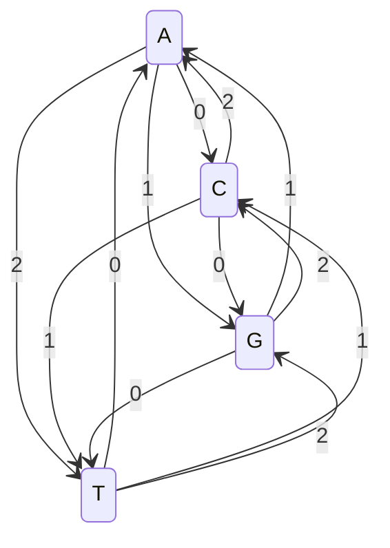
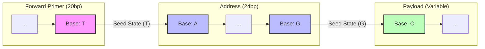

# Helix Encoding Specification (HES-1)

**Version:** 1.1.0
**Status:** Stable
**Author:** [Seuriin](https://github.com/SSL-ACTX)

---

## 1. Abstract
This document defines the **Helix Base-3 Rotating Trellis**, a constrained coding scheme for mapping arbitrary binary data onto DNA strands. The encoding guarantees **GC-content balancing** and **Homopolymer prevention** (Run-Length Limited constraint $k=1$), ensuring compatibility with standard phosphoramidite synthesis and Nanopore/Illumina sequencing.

## 2. Data Transformation Layer

### 2.1. Binary to Ternary (Trits)
Input binary data is treated as a stream of bytes. Each byte (8 bits) is decomposed into 6 trits (base-3 digits) to maximize density while respecting the coding constraint ($log_2(3) \approx 1.58$ bits per base).

**Algorithm:**
Given a byte $B$ ($0 \le B \le 255$):
1. $t_0 = B \pmod 3$
2. $B_1 = \lfloor B / 3 \rfloor$
3. Repeat until 6 trits are generated.

> [!NOTE]
> $3^5 = 243$, which is insufficient to store 256 values. $3^6 = 729$, which is sufficient. The remaining address space is used for control signals or padding.

## 3. Finite State Automaton (The Trellis)

The core encoder is a **Mealy Machine** where the output depends on the current state (Previous Base) and the input (Current Trit).

* **State Space ($S$):** $\{A, C, G, T\}$
* **Input Alphabet ($I$):** $\{0, 1, 2\}$
* **Transition Function ($\delta$):** $S \times I \rightarrow S$

### 3.1. Mathematical Definition
Mapping bases to $\mathbb{Z}_4$:
$$A \mapsto 0, \quad C \mapsto 1, \quad G \mapsto 2, \quad T \mapsto 3$$

The transition function is defined as:
$$S_{n} = (S_{n-1} + I_n + 1) \pmod 4$$

### 3.2. State Transition Table

| Previous Base ($S_{n-1}$) | Input Trit ($I_n$) | Computation | Next Base ($S_n$) |
| :--- | :---: | :--- | :--- |
| **A** (0) | **0** | $(0 + 0 + 1) \pmod 4 = 1$ | **C** |
| **A** (0) | **1** | $(0 + 1 + 1) \pmod 4 = 2$ | **G** |
| **A** (0) | **2** | $(0 + 2 + 1) \pmod 4 = 3$ | **T** |
| | | | |
| **C** (1) | **0** | $(1 + 0 + 1) \pmod 4 = 2$ | **G** |
| **C** (1) | **1** | $(1 + 1 + 1) \pmod 4 = 3$ | **T** |
| **C** (1) | **2** | $(1 + 2 + 1) \pmod 4 = 0$ | **A** |
| | | | |
| **G** (2) | **0** | $(2 + 0 + 1) \pmod 4 = 3$ | **T** |
| **G** (2) | **1** | $(2 + 1 + 1) \pmod 4 = 0$ | **A** |
| **G** (2) | **2** | $(2 + 2 + 1) \pmod 4 = 1$ | **C** |
| | | | |
| **T** (3) | **0** | $(3 + 0 + 1) \pmod 4 = 0$ | **A** |
| **T** (3) | **1** | $(3 + 1 + 1) \pmod 4 = 1$ | **C** |
| **T** (3) | **2** | $(3 + 2 + 1) \pmod 4 = 2$ | **G** |

### 3.3. State Diagram

## 4. Constraints Guarantee

### 4.1. Homopolymer Prevention

A homopolymer occurs if .
From the definition:

Since , then .
Because , it implies .
**Q.E.D.**

### 4.2. GC Content

The transition probabilities for any state are uniform ( for each target). Over large datasets, the distribution of output bases approaches:

* A: 25%
* C: 25%
* G: 25%
* T: 25%

Expected GC Content: .
This sits perfectly within the stable synthesis window of 40-60%.

## 5. Oligonucleotide Structure (Physical Layout)

To ensure retrieving and decoding capability, all DNA strands generated by Helix must adhere to the **Chained Trellis** structure.

### 5.1. The Packet Format

| Segment | Length | Description | Trellis Seed |
| --- | --- | --- | --- |
| **FP** (Forward Primer) | 20 bases | PCR amplification target (Zip Code). | N/A |
| **Addr** (Address) | 24 bases | Encoded Block ID + Shard Index. | Last base of **FP** |
| **Payload** (Data) | Variable | Encoded Binary Data (with CRC32). | Last base of **Addr** |
| **RP** (Reverse Primer) | 20 bases | PCR amplification target. | N/A |

### 5.2. Trellis Chaining Rule

To maintain the homopolymer constraint across segment boundaries, the **first base** of any segment is calculated using the **last base** of the previous segment as the state . This chaining prevents structural weak points where the primer joins the data.

* $S_{Addr\_Start} = \delta(Last(FP), Trit_0)$
* $S_{Payload\_Start} = \delta(Last(Addr), Trit_0)$

This guarantees that no "seams" exist in the DNA strand where a homopolymer could accidentally form (e.g., if Primer ends in `A` and Address starts in `A`).

---

*© 2026 Project Helix*
